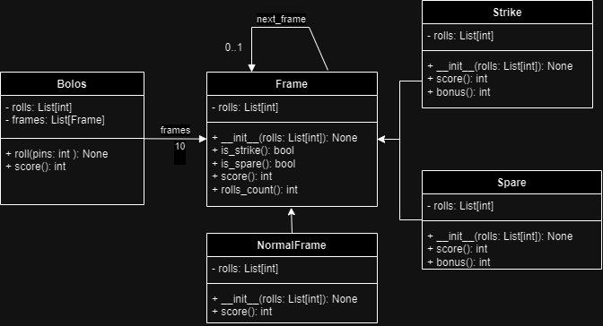

# Bolos Game Scorer
Este es un programa simple en Python para calcular la puntuación de un juego de bolos. El programa proporciona una clase Bolos que permite registrar los lanzamientos y calcular la puntuación total del juego.

## Estructura del Proyecto
El proyecto está estructurado en tres archivos principales:

- bolos.py: Este archivo contiene la implementación de la lógica del juego de bolos. Incluye las clases Bolos, Frame, NormalFrame, Spare y Strike.

- consola.py: Este archivo maneja la entrada y salida de la consola. Contiene código para solicitar los lanzamientos al usuario y mostrar la puntuación total del juego.

- main.py: Este archivo es el punto de entrada principal del programa. Se encarga de llamar a las funciones y clases necesarias para ejecutar el juego de bolos.

